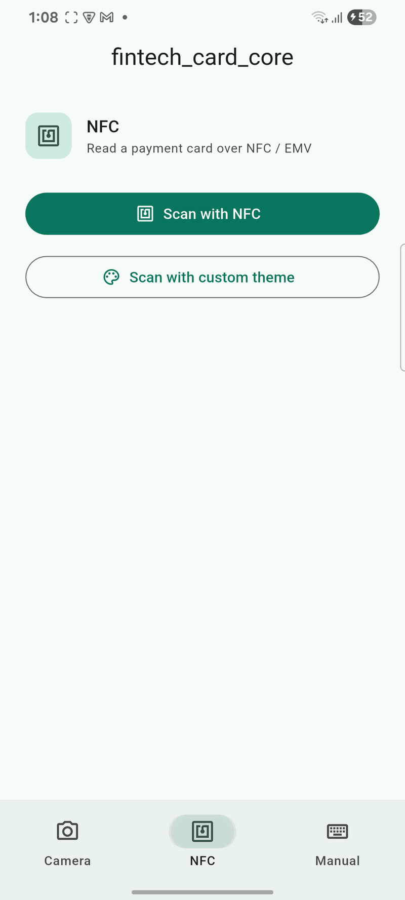
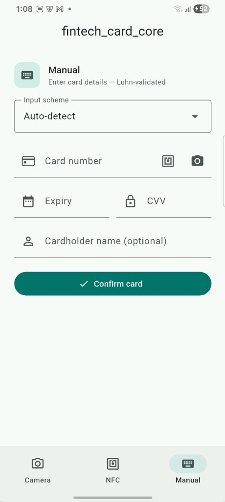

# fintech_card_core

Headless Flutter plugin for payment card reading — **NFC (EMV)**, **OCR**, and
**manual entry** — with optional UI widgets.

<p align="center">
  
  &nbsp;
  
  &nbsp;
  
</p>

<p align="center">
  <b>NFC</b> &nbsp;·&nbsp; <b>Camera OCR</b> &nbsp;·&nbsp; <b>Manual form</b>
</p>

## Platforms

| Platform | Min | Notes |
|----------|-----|--------|
| Android | API 24+ | IsoDep NFC + CardScan SSD (TFLite) |
| iOS | 13+ | CoreNFC bridge + CardScan SSD (CoreML) |

Web and desktop are not supported.

## Install

```yaml
dependencies:
  fintech_card_core: ^0.1.3
```

```dart
import 'package:fintech_card_core/fintech_card_core.dart';
```

## Quick start

```dart
final controller = CardReaderController();

controller.stateStream.listen((state) {
  switch (state) {
    case CardReaderSuccessState(:final data):
      print(data.maskedPan); // **** **** **** 1234
    case CardReaderErrorState(:final exception):
      print(exception.message);
    default:
      break;
  }
});

await controller.startNfcScan();
// await controller.startOcrScan();
// await controller.submitManualInput(
//   pan: '4111111111111111',
//   expiryDate: '12/28',
//   cvv: '123',
// );

controller.dispose();
```

### Camera overlay

```dart
final card = await CardScannerOverlay.show(
  context,
  controller: controller,
  enableCoachingHints: true, // timed lighting / torch tips
  sideLightHint: 'Hold the card in side lighting',
  torchHint: 'Move away from bright light — turn on the torch',
);
```

### Smart card form

```dart
SmartCardInput(
  controller: controller,
  scheme: CardInputScheme.autoDetect, // or humoAndUzcard, americanExpress, …
)
```

## iOS NFC setup

Host apps must add NFC entitlements and Info.plist keys. See
**[doc/IOS_NFC_SETUP.md](doc/IOS_NFC_SETUP.md)**.

> **Important:** Standard CoreNFC (`NFCTagReaderSession`) does **not** allow
> payment-related AIDs. Android IsoDep can read EMV payment cards; the same
> card generally cannot be read on iOS without Apple’s separate payment NFC
> programs.

## Privacy

This plugin reads card PANs and related fields on-device. Do not log full PANs,
persist them insecurely, or send them to analytics. Prefer `CardData.maskedPan`
for display.

## License

MIT. CardScan SSD OCR ports are MIT (Stripe / Bouncer); see `third_party/`.

## Additional docs

- [OCR pipeline](doc/OCR_PIPELINE.md)
- [iOS NFC setup](doc/IOS_NFC_SETUP.md)
